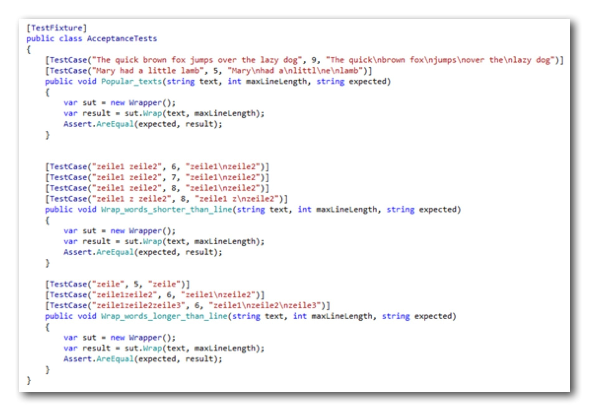

# Recursively Descending Test-Driven Development Aided by Thinking

"Hey, Ron, wanna try something new", Janine asked across the table in their team room. Ron looked at her uneasily over his line of monitors. For hours he had been trying to fix this elusive bug.

"Nah, not now. I really need to get this done first, Jan."

"Oh, come on, Ron, that´s what you´re telling us all the time."

Ron blushed. That certainly wasn´t true. Especially not with regard to Janine.

"You know me better than that, Jan. I´m always willing to help you out and stuff. But right now..."

"It won´t take long, Ron. Promised. It´s just so cool. You´ll like it. And... maybe it even helps you with your current problem. Who knows..." Janine winked at him -- and of course Ron´s resolution to not again get distracted by her crumbled. He sighed and rolled his chair next to her.

"Ok, what´s it? You better make it quick, Jan -- and exciting."

Janine beamed at him. Then with a secretive look and a hushed voice she said: "I found a better way to approach coding. We´ve been doing TDD, right. We´ve tried hard to do it right, to do it by the book."

Ron nodded slowly. What was she trying to get at? For the past couple of weeks they had run coding dojos with their team to get up to speed with TDD. Finally. He strongly hoped she wouldn´t suggest to deviate from that course. It had been difficult enough to convince their colleagues to at least try automated tests. Those guys were old code cowboys and not so happy to be asked to learn new tricks.

"Oh, Ron, don´t give me this skeptical look again. Please. It´s not what you might think. TDD is cool -- but we can do even better. Remember how we had a hard time doing the kata Roman Numerals? We tried hard, we moved along in tiny steps -- but in the end of our timebox we had not finished the task."

Yes, he remembered that particular coding dojo very well. Their colleagues had been very frustrated.

"Sure. But our retrospective made clear what we´d done wrong, didn´t it? It was a matter of wrong test priorization."

"That´s right, Ron. But why did we get the test prios wrong? Again, that is. Because we didn´t give it much thought. Because we did not think about the solution first. We were so eager to get coding..."

"Well, only in code lies truth, Jan. You know that."

"True, Ron, true. In the end at least. But what code to write? Where should the code containing all the truth come from? How do we transform a test case into code?"

Ron stared at her blankly. What was this? A lesson in philosophy? Programming is about detail. Code represents all those details. Details need deep technological knowledge. Without solid craftsmanship no running code would get to their customers.

"Come on, Jan. Don´t play this kind of game with me. You know I hate it. Just tell me what you want to tell me."

Janine sighed. Usually Ron was very pleasant to work with. A guy who liked to explore the unknown like she did. But sometimes... She took a deep breath, turned to her monitors and pointed to a C# file.

"Ok, Ron, see those test cases? It´s the kata Word Wrap. We did it a while ago. Tried to do it like we saw it on the web [in Robert C. Martin´s blog](http://thecleancoder.blogspot.de/2010/10/craftsman-62-dark-path.html). And then -- you remember? -- George came up with this additional test case. And our solution did not handle it correctly. Neither did Martin´s show case solution."

Ron nodded. That had been one of the more successful coding dojos -- well, until they found out, TDD had not led them to a bug free solution right away.

"I have pondered long about why in the end we failed. And I guess I´ve found the root cause. We did everything right TDD-wise. But we did not enough thinking upfront."

"What? We should think more ahead? Big design up-front, Jan? You can´t be serious. Our retrospective clearly showed we just failed to come up with the additional test case. Had we added it to our list we surely would have also solved that problem."

"Yeah, you´re right, Ron. But how can we think about test cases in the first place if we don´t have a clue about our solution? Test cases not only depend on the customer, but also on how we design the code."

"Yes, the design naturally flows from the test cases and is refined through refactoring."

"Ron, just listen to what you´re saying. I know, this is how we´ve thought so far. But can this be true? How can code flow from test cases? Code, and its design are the result of our thinking. We plan code before we write it. Maybe we´re not aware of it, but there´s no other way. It is born in our heads. Before we code. The questions are just: When? And how explicitly?"

He took a deep and somewhat resentful breath -- but before he could retort, Janine drew him back to the code.

"I know, this sounds theoretical and somehow against what we´ve read about TDD and stuff. So let me show what I did. _I read a blog post about an alternative approach to test-first programming_and tried the suggestions out. Just follow me for a couple of minutes, will you?"

Ron gnashed his teeth, but kept silent and noded.

"Ok, thanks, Ron, honey.", Janine said and smiled at him disarmingly. "I want to do the kata Word Wrap with you in a different way. These acceptance tests are our starting point. Currently they are all red. Of course. The _Wrap()_ method just throws a _NotImplementedException_. I want to flesh out its implementation together with you."

"It´s all the canonical unit test cases -- including the one which brought our prior implementation to its knees. And two more test cases with real texts. Just for the fun of it. Now, what I want to do differently is: I want to think about our solution approach first."

"What do you mean by 'thinking'? Do you want me to draw an UML diagram, or what?"

"No, no, Ron. No UML. You know I hate that, too. I mean, well, just 'thinking' or talking about how we would accomplish the word wrapping task by hand."

"By hand? We need to code, Jan."

"Yes. In the end we need to code. But software always does what we as humans could do by hand or in our heads. Just much faster. It´s the non-functional requirements software is written for. Functional requirements can always be fulfilled without software -- given enough time and money."

"You mean, functionality is not important?", Ron exclaimed in disbelief.

"No, of course. It´s essential. But... Oh, no, let´s no digress. We can talk about that later. Let´s focus on the kata for now. How could we do 'wrapping words' by hand?"

Ron stared blankly at her. After a short pause Janine took a piece of paper and a pencil and wrote:

_1. Split text into words_

_2. Build lines from words_

"How about that, Ron? Wouldn´t that very simply describe how word wrapping could be done?"

"Hm... yeah, sure. But that´s not code. It´s just words. You don´t know if this is actually working."

"Oh, Ron... Of course this is just words. But those words can be translated into code, can´t they? We do that all the time. Look here."

{width=70%}

"This is not just words, it´s even bubbles, Ron. I know, they don´t crash. But still it´s a representation of our code. It´s like a little plan: We intend to write a functional unit which transforms an incoming text into an outgoing text with line breaks. It´s like a map of our code. It´s not the code itself, just an abstract view. The same is true for what I´ve written above. It can be depicted like this."

"I just refined the first functional unit. The finer grained functional units describe how the mission of the coarse grained unit can be accomplished. You know how to transform the coarse grained unit into code -- you define a function. So why not do the same with the finer grained units?"

"What do you want me to do, Jan? Write three functions without a test? Is that your new shiny road to reliable code?"

"No, Ron, not that quickly. First I want you to see that thinking brought us closer to the solution. Instead of a big problem, we´ve two smaller problems. And we have a simple hypothesis: if there was a function 'split lines into words' which did what´s suggested by its name, and there was a second function 'build lines from words' which did what its name suggested, then their combination would solve the word wrap problem. Yes, it´s just a thought. But one that can easily be verified. By code. Give it a try. Write a simple failing test for the _Wrap()_ function. I´ll then take over and show you what I mean."

At the prospect of writing code Ron relaxed visibly. He gently pushed aside Janine on her chair and grabbed her keyboard. In no time he set up the following code:

{width=70%}

"Thanks, Ron. I see you´re cutting right to the chase. You´re right, we don´t want to waste our time on unenlightening trivialities like tests for null or empty strings. Now let me show you how I want to turn this test to green. Currently it´s failing because there is no solution code behind the _Wrap()_-facade. Let´s change that first."

Janine took over the keyboard and fleshed out the _Wrapper_ class like this:

