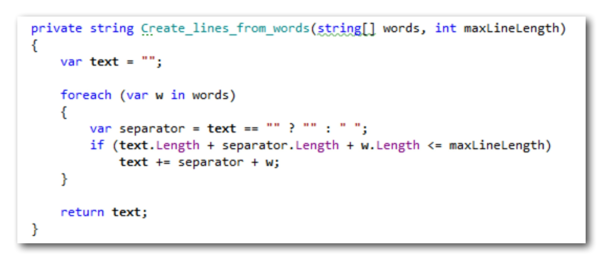

"I hope you see I translated our solution idea into code. The job of _Wrap()_ now is to just integrate two functions into a larger whole. How those functions accomplish their sub tasks I don´t know yet. Before we turn to that let´s check our hypothesis. Let´s turn the test green."

"How do you wanna do that, Jan? Those functions both throw exceptions."

"Well, Ron... let me apply some very, very advanced technology here -- which is indistinguishable from magic, as you know", Janine said grinning while mimicking Hermine wielding her magic wand. "But to be honest, I just downloaded a cool mocking framework called [JustMock from Telerik](http://www.telerik.com/products/mocking.aspx)."

"This test proves: if those two functions worked correctly, the whole would work correctly. You could say: we just fake it until we make it."

Surely the introduction of a new tool grabbed Ron´s attention. Regardless of Janine´s strange approach to programming this was something to take a closer look at. Maybe she was right and this little breakout session with her could help him fix the darn bug.

"Jan, even though I don´t know if I like your approach, I´m amazed at how this mocking framework of yours can replace even private methods. How about methods from .NET Framework types or even whole types? Have you tried that?"

"No, Ron, I haven´t. And please let´s not get carried away here. I know it´s a cool tool. And you can check it out later. For now please stay with me. I want to show you how I think this technology can help us become better at TDD."

Ron moved a bit restlessly in his chair, but Janine was able to regain his attention by asking him to write a next test.

"Since this test is green, why not move on? We need to tackle one of the smaller problems now. This approach I want to show you is recursive. TDD is applied on every level. So why not write a red test for _Split_into_words()_? Ron, your turn again."

Ron looked puzzled. "But, Jan, those methods are private. How could I write a test for them?"

"Oh, Ron, you baby, don´t you trust our new shiny tool? Here let me show you."

"But you´re not even supposed to test private methods. They are details hidden behind the public interface of a class for a reason."

"That´s true, Ron. But as you´ll see, we won´t violate this rule for long. Come on, get this test to green. Be a good craftsman for me, will you?" And so Ron dug into his knowledge about string manipulation with C#.

"Great! It´s simple, yet pretty comprehensive, I guess. This not only covers the happy day case of the test, but also a few other scenarios. I guess, as long as we keep our requirements constant, that words are separated by spaces, this will do. So let´s go back to our hypothesis and retest it -- but now with the real functional unit instead of a mock. Can you imagine what I want to do?"

Ron frowned. But then his eyes opened with near despair. "Oh, no, Jan, you´re not gonna change the previous test, are you? You´re not supposed to do that."

"Yes, Ron, that´s exactly what I´m gonna do", replied Janine with her well known comforting voice. "Why not change a test? It´s nothing sacred. Esspecially not these 'under the hood' tests. They are all just temporary skaffolding while erecting our code building."

"The test got simpler. And now it´s even more valuable, because our hypothesis is even true for some real functionality, not just fake bubble implementations. And now let´s repeat these steps for the second processing phase of our solution. Your turn again, Mr. Craftsman."

Ron turned to Janine´s keyboard and applied his newly won knowledge of JustMock:

"This sure is a non-trivial test, Ron. And I´m eager to see, how you´re gonna get it to green," said Janine smiling in a way that made Ron feel a little strange.

"Well, I choose the simplest possible implementation first."

"Yeah, but what´s that? Do you want to return the string 'a b'?"

"No, Jan, of course not," said Ron a little unnerved. "I´ll actually solve the problem of joining words into a line."

"Oh, how clever of you, Ron!" Janine acclaimed jokingly and clapped her hands. "That get´s us to a very cute light green. But not more, you know. Because it does not even try to use the second parameter."

"Sure not. The test case does not require it. That´s the point about making test cases progressively more complicated."

"You´re right, Ron. About the test cases. But why make the solution overly dependent on the test case? Why eschew the opportunity to really learn something about the problem domain? The second parameter is there for a reason. Admitted: if it wasn´t there, this would be a good first try. But we´ve design the function with a second parameter for a good reason. It´s the workhorse function of our solution to the word wrap problem. So we need the second parameter. That´s not looking into a crystal ball, but solid untderstanding of the problem at hand. But anyway. Leave it as is and move on to a second test. I guess we´re agreeing at least on that we need one more."

Ron wanted to reply -- but then settled for doing as asked. That way he´d surely get back to his computer more quickly for some real exploration of JustMock.

"Yes, that´s what I thought of, too. Now watch what happens to your previous solution..."

Ron switched to the implementation of _Create_lines_from_words(),_ pondered the one-line solution, frowned -- and then his eyes lit up.

"Ah, I see what you mean. I have to throw it away. Right? There´s nothing I can carry over from the previous test, because now the second parameter becomes important, but I did not use it."

Janine nodded and smiled at him broadly. "You got it, pal."

"So let me fix this first. I´ll replace the trivial solution with one that´s actually tackling the problem -- but still in a simple way. How about this?"

"That looks much better, I guess. Even though we know the maximum line length is never exceeded, this code demonstrates an idea of how it can come into play. But let´s not dwell on this for long. We´ve to solve the new test case."

"Right, mam, at your service," Ron said jokingly and continued implementing the function.

"This does the job, Jan. But I´m not 100% content with it. Looks a bit clunky, doesn´t it?"

"Yeah, I guess so. But then... it´s just some 20 lines of code. The purpose is pretty clear. Important terms from the ubiquitous language are present like text, line, max. line length. You even extracted a method for adding a finished line to the text."

"That was an experiment. I saw nested function definitions in F# and liked it. So I thought about how to mimick that in C#."

"Pretty nifty to use a lambda expression. Yeah, why not. Let´s leave it at that. We can always come back and refactor more or even find a better overall approach. But first we want to go back to our hypothesis..."

"You want to remove the second mock?"

"Exactly! Then we´re truely gonna see, if our hypothesis was true."

{width=70%}

"Ah, finally! This looks good. It´s still green. So we were right, Ron. Now, let´s check how many of our acceptance tests have also turned green."

"Hey, look at this! More than half of the acceptance test cases are already fufilled by our solution. Not bad for a start. And the non-canonical test case which crashed our coding dojo solution is among the green tests. That´s especially great because we didn´t labor much about the individual cases. Remember how we discussed where and when to break lines? But now, with just a little thinking before coding, with an idea of a conceptual solution, we just covered it."

"That´s true, Jan. Maybe this approach of yours isn´t that bad in the end."

Janine blew Ron a kiss.

"But don´t go overboard now, Jan! The devil is in the detail. We´ve three more tests to go."

"Ok, ok. Let´s move on. We need to tackle the next category of tests: what about words longer than a line? First a red test. Your turn again, Ron."

"That was the category we started the coding dojo with. But I guess it´s more natural to do it second. The probability for such long words is small -- at least in the real world, I suppose. So it´s a special case."

{width=70%}

"The test was easy to write. But how should we go about to make it green, Jan? You sure have your own ideas about that."

"I sure have, Ron. Because we´re again in a situation where we need to find a solution first, instead of quickly slinging code. The current implementation does not cover the test case. What´s our idea of how to tackle wrapping long words?"

"Hm... as far as I remember they may be cut off at any point. There are no special requirements for something like hyphenation."

"Right. That makes it easy to enhance our current solution, I presume. How about adding a processing step between the exiting ones? That way we would not need to change existing code, except the simple integration function _Wrap()_."

_1. Split text into words_

_2. Split long words into "syllables"_

_3. Build lines from words_

"I call the split words 'syllables' because that´s what they look to me, even though we won´t use hyphens at the end of lines. At least for now."

"Sounds good to me. Makes for a precise term of our ubiquitous language. However, is it ok to split all long words into syllables, Jan? In the usual kata solutions words are split at the end of lines, only. But this approach will do it proactively."

"I don´t find the requirements very clear about this aspect. So I assume we´d be within the boundaries of what´s permissible. And in the end at least the canonical acceptance test cases will tell."

"Ok, let´s try it this way. Now, let me see if I understand your approach. Is this how you´d enhance the code: put in a function for the processing step and first mock it to get the test to green?"

"Right on, Ron! That would make our hypothesis tangible."

"The mock-up nicely plays together with the other functions. The test is green. Now we´ve to drill down and focus a test on the new function _Split_long_words()_. You wanna do that, Ron?"

"Sure. Especially since the first test again is the easier one."

"Yeah, I see, you´re going for the low hanging fruits, Ron. But you know: the test is only half the fun. I want to see you sweat over a simple, but not too simple implementation. Remember: don´t eschew solving the problem."

"I saw that coming, Jan, I have a plan already. Take this."

"That looks great, Ron!", Janine said nudging Ron jokingly. "What´s up next?"

"Well, I guess a test for truely long words. But guess what: Even I can now see that´s a task calling for a function of its own. A function to split a single long word. And that needs to be mocked first."

Janine´s jaw dropped as she looked at Ron in disbelief. Was it possible he already had gotten the knack of her new approach? Yes, it seemed so. How cool was that...

"Yeah, I know, you thought, I would be more skeptical. But I can feel what you mean. This really is a helpful way to do TDD. It´s small steps. But these steps are better guided. Guided by thinking. I like it."

That said Ron showed Janine how he thought they should continue. First a red test using mocks:

Then the enhancement in the production code:

This turned the test green. Another hypothesis formulated.

"That feels like a systematic process, doesn´t it, Ron? If stuff is more than trivial, then the test data is not enough. Some idea of how the expected result is supposed to be created is in order -- and should be encoded in the test."

"Yes, the mocks are representations of a design idea -- which needs to be validated."

"And this is true on any level of abstraction as we can see. We did it like this on the top with _Wrap()_. And we´re doing it again down here."

"Yep. But with each level it becomes easier. The functions become smaller. Look at my stab at this new function. A test first, then an implementation."

"Impressive, Ron, impressive. You wrote that down in no time. Had it all in your head? Oh, you´re my hero coder of the day...", Janine purred and Ron blushed. He knew she was joking, but still... There was something about Janine, he liked very much. At least as long as she didn´t try to talk with him about some of her even more esoteric ideas on software development. Like event sourcing or reactive something.

Then, when Ron opened his mouth after a tiny, but uncomfortable pause, Janine threw up her arms and called out loud: "Look, Ron, we´re done! All tests are green! All of them!"

Ron swallowed a supposedly funny remark he was about to make about him being her hero and looked at the code. Indeed, all methods where shown with a green dot next to them. That meant, [NCrunch](http://www.ncrunch.net/), the background test runner, had found no failing test.

"Wow. Awesome! That means all our acceptance requirements are fulfilled. And that means, our approach to splitting long words can´t be all that wrong."

"Well, what can I say... So, cool Ron! Your implementation did it. We don´t even need to remove the mocks on the higher levels. The proof is in the acceptance tests."

Nevertheless they took out the mocks and found their hypothesises validated.

"Jan, I need to say...", but Janine interrupted Ron. "There´s one more thing I want to show you, Ron. Watch, what I´m doing now. We checked in the current state of the code. Right? Ok, here we go..."

And Janine deleted all the unit tests.

Ron nearly fainted. All their precious work gone...

"What are you doing, Jan?!"

"I´m cleaning up, Ron," said Janine and smiled broadly. "Clean code does not mean it needs to be clean all the time. We can -- and should -- make a mess while working on the code. In the end, though, once we´ve reached our goal, we need to clean up. That also means to throw away any scaffolding code or any code we produced along the way while 'grinding' our implementation."

Ron wiped some sweat from his brow. This girl really knew how to shake up his convictions.

"Look, Ron, this is like building a house. While building it, you make a mess. You set up all sorts of additional structures to easily produce the building. Think of how the Egyptians build the pyramids. Today you only see those geometrical shapes -- but while they were building them, there were all sorts of ramps. Otherwise it would have been impossible for them to drag those heay stones up to the top."

{width=60%}

"Or think of the last time you made dinner for someone. You surely made a mess while cooking, no, even in order to cook. But in the end, there was just cleanly layed out food on the plates. All the mess gone into the trash can or the dish washer."

Whether this was true, Ron couldn´t remember at the moment. Janines images evoked not so nice memories of the final period of his marriage. His wife and him trying to mend their relationship by doing more stuff together like cooking. But, alas, to no avail. It even seemed that "pair cooking" upset them more than bringing them back together.

"...but just chippings. -- Ron? Hello?"

"Yes, what? Oh, I´m sorry. What did you say?"

"I said, we´re not throwing away precious code, but just chippings. Or molds. That´s perfectly fine. It makes for better focus. And look at the test coverage: it´s still 100%."

"Shedding all the detailed tests also makes it easier to change our solution later. We don´t need to be careful to not break any tests, but can refactor boldly -- as long as the acceptance tests stay green. And if we need to zoom in on a detail, e.g. if we want to change how long words are treated, we (re)create any tests we need."

Ron nodded. This was quite a bit of input for him. At he beginning he had be skeptical about a new approach to TDD. Then he got the knack of "thinking before coding". And the mock framework was fun. But trashing all their test work... he wasn´t convinced yet despite all the effort Janine invested.

"Jan, this sounds good, when you describe it like this. However, I guess I need some time to digest this experience."

This saddened Janine a bit. She had the impression, Ron had jumped on her bandwagon. But then... the capacity to absorb changes to one´s beliefs is different from person to person. Maybe she really had been too enthusiastic at the end.

"Ok. I´m sorry if I blew it. I just was so excited about how well this approach was working, and about JustMock, and all. You know, I thought this really could spark up some new experiments in our coding dojos."

Ron smiled at her a tad tired.

"Yes, Jan, we´ll try it out next time with Dave and George. But now I need to go back to my bug. It probably hasn´t fixed itself in the meantime. But, hey, thanks for calling me over. This was fun. And I´ll check out JustMock. I have a hunch it can help with the bug."

"Alright, then, Ron. Thanks for listening to my babble. It was good to go through this again by telling somebody. Helped to clear up my thinking."

Ron was about to turn around his chair when Janine got up and very lightly hugged him. Then she quickly turned around and barely audible added "Thank you, Ron."