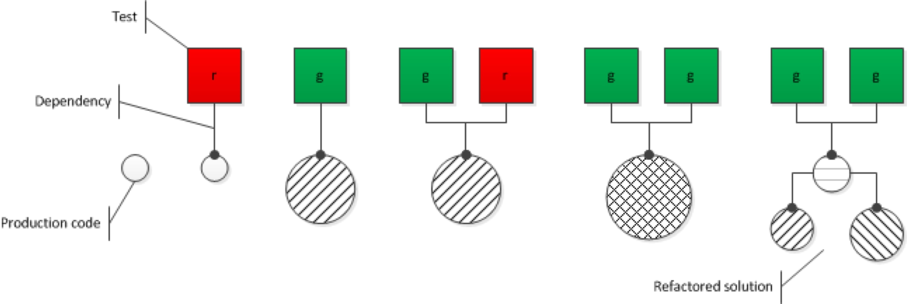

# Using Mocks to Allow for True Stepwise Refinement

In my previous article I described a process of designing and implementing software. It combined TDD with explicit thinking before coding. The dialog I embedded it in was supposed to make this deviation from traditional descriptions of TDD more palatable. This came at a price, though. The systematic behind this approach was somewhat hidden. This article is supposed to make up for that. I want to make it crystal clear how I think the process of solving problems with code should look like.

## "Traditional" TDD

But first a recapitulation of how TDD "traditionally" is depicted. I´m not saying this is how its inventor(s) thought it should be done. Whatever they had in mind, though, got reduced to this:

For a given functional unit of production code you write a test. It´s red/failing first. Then you do the simplest possible thing in production code to change it to green/passing. Finally you refactor.

Sounds simple. And it is simple -- technically. The hard part of TDD is in the, well, details. Or in the cracks between these steps.

Question number #1: Where do the test cases come from? From the customer? Hardly at the level of detail that´s needed to drive out a solution from the inital ignorance. The customer of course should provide acceptance test cases. But they are coarse grained. What´s needed to refine the solution in small steps are fine grained test cases. And they should be in a certain order so that the solution code really can become progressively more complicted.

So where do those nicely prioritized fine grained test cases come from? That´s rarely explained in the TDD literature. Authors try to derive them from the problem itself or maybe from some acceptance test cases. But never have I seen test cases being linked to the solution. The reason for that is simple: the solution is supposed to somehow emerge.

You write a failing test, then switch to the production code side, and there you just do the simplest thing possible. Solution follows test case. That´s the "traditonal" TDD mantra.

Unfortunately I´ve seen many, many developers fail at that. They make quick progress -- with obvious and trivial test cases, so called "degenerate test cases". And then they hit a wall.

Try this for yourself with the famous Roman Numerals code kata. It´s about a function (e.g. _string ToRoman(int number)_) to convert arabic numbers like 5, 19 or 42 into roman numbers: V, XIX, XLII.

How does your list of test cases look like?

Let me speculate: 0, 1/I, 2/II, 6/VI, 4/IV, 9/IX, 40/XL, ...

First the degenerate test case: 0. Because there is no zero in the roman number system. You need to check for this input, though. Don´t you? That´s good defensive coding practice.

Then the simplest roman number: I. It consist of just a single character.

Then a sequence of the same character/number. A sequence of like values is "higher order" than a single value.

Then a sequence of different characters/numbers. A sequence of different values is "higher order" than a sequence of like values.

And now for the fun part: the first of those pesky numbers with "reversed digits". Usually "larger" roman digits precede "smaller" ones like in XVI. But some numbers require for a reversal of this order like in IV or IX or XL.

Given the premise "solution flows from test case" this would be a perfectly reasonable order and granularity of test cases. At least that´s what I´ve seen many times. And you can find it in the literature, too.

In reality, though, -- as is often the case compared to technical or recreational literature -- things work out differently. And so it happens more often than not, that developers doing the Roman Numerals kata like this to exercise their TDD skills fail. They do not arrive at a working solution in a moderate time frame of, say, 60 minutes.

Of course several excuses are readily at hand. I´ve read and heard often for example "We wanted to have fun. So we did not really focus on a solution." or "We wanted to focus on the red-green-refactor steps. A working solution is not that important."

That´s all nice and well. I don´t want to deprice anybody of his or her fun with TDD or at their dev community gathering. Also I fully understand that in order to learn A you sometimes need to sacrifice B and C for a while. Otherwise you can´t fully focus on doing A right. In the end, though, that means in your daily work practice, A + B + C must come together.

But, hey, come on. What are we talking about here? Roman Numerals is a trivial problem. It´s orders of magnitude simpler than anything you´re doing for profit. It´s like drawing a stick figure compared to the Mona Lisa.

No, I don´t buy "focussing on the TDD steps" as an excuse for not solving a trivial problem in an expanded timeframe like 60 or even 90 minutes. That´s inacceptable for any method. And it neglects the need for closure. Developers want closure. They want to accomplish something, that means they crave for building something that works. Failing to satisfy this need hampers any learning.

And finally: Even if working solutions are produced, I rarely have seen any which really have lived up to the full TDD process consisting of three steps. The refactoring step often is skipped altogether. "We can refactor later. First let´s get this baby off the ground. We need working code."

Most TDD solution on the internet don´t show any sign of refactoring. Their design is... well, "as usual".

If you think about this for a minute, this is very plausible for two reasons. Firstly, closure is reached if the functionality is implemented. Clean code is not needed. Secondly, where should a good design come from? TDD does not contain any hints on good design. It just commands: "Thou shalt refactor once the test passes." But as is with most of such commandments, they are overheard in favor of some seemingly more important issue.

And since rules for good design are orthogonal to TDD, refactoring is neglected except for fairly trivial cases.

Please get me right: I´m not against TDD. Red+green+refactor are great -- if they only produced the results the claimed on a satisfying scale.

So this is why I´m looking for a different approach. Can the "traditional" TDD approach be improved. And I think it can. One way to improve it has been described by Keith Braithwraite as "TDD as if you meant it". It improves on the refactoring step. With it refactoring becomes inevitable. Great!

Another way to improve the TDD rhythm is by thinking before coding:

## Informed TDD (ITDD)

My experience is, software development becomes easier if we think before coding. Sounds trivial. Sounds like something everyone´s doing already. But I beg to differ.

We´re far to quick to grad our keyboards and start coding. The lack of working code for the "stick figure problem" Roman Numerals after 60 minutes to me is proof to that. If experienced developers are unable to code a solution -- with or without TDD -- in that timeframe, then something is wrong.

What´s missing is not good will, motivation, technical skill. It´s experience in conceptualizing solutions. Systematically thinking problems through to arrive at solutions or at least reasonable (rough) ideas of solutions is an art not valued -- at least in many developer circles I´ve attended in the past years.

Everybody is trying his/her best. Of course! There is no lack of motivation. However, the hard work put into software development sometimes resembles a prison inmate trying to dig his way out with his bare hands. It would be much easier for him had he a pick ax, or even some explosives at his disposal. Or better: a key. Or even better: not be in prison in the first place.

But to someone sitting in a whole these don´t seem to be options. That´s why we need an explicit emphasize on thinking. We need preventive measures. Before developers convict "the crime of premature coding".

For this article I want to call what I´m trying to bring across "Informed TDD". This is to underline the value of TDD -- while at the same time adding a missing piece, namely information. Information about the solution to be coded.

Ok, here´s how Informed TDD (ITDD) differs from Traditional TDD (TTDD).

{width=30%}

