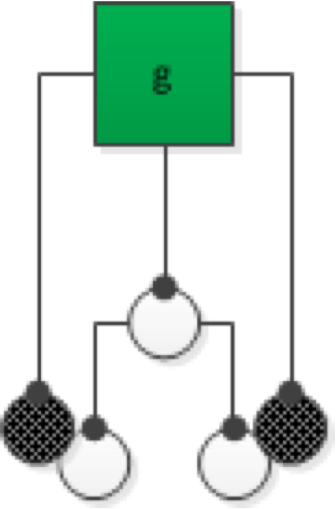
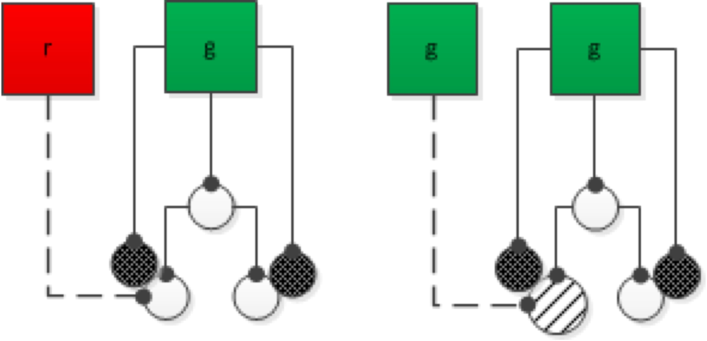
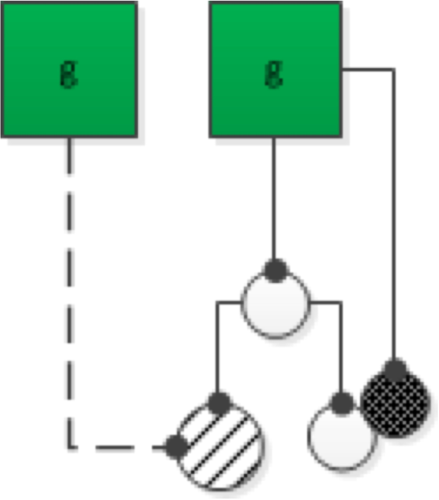
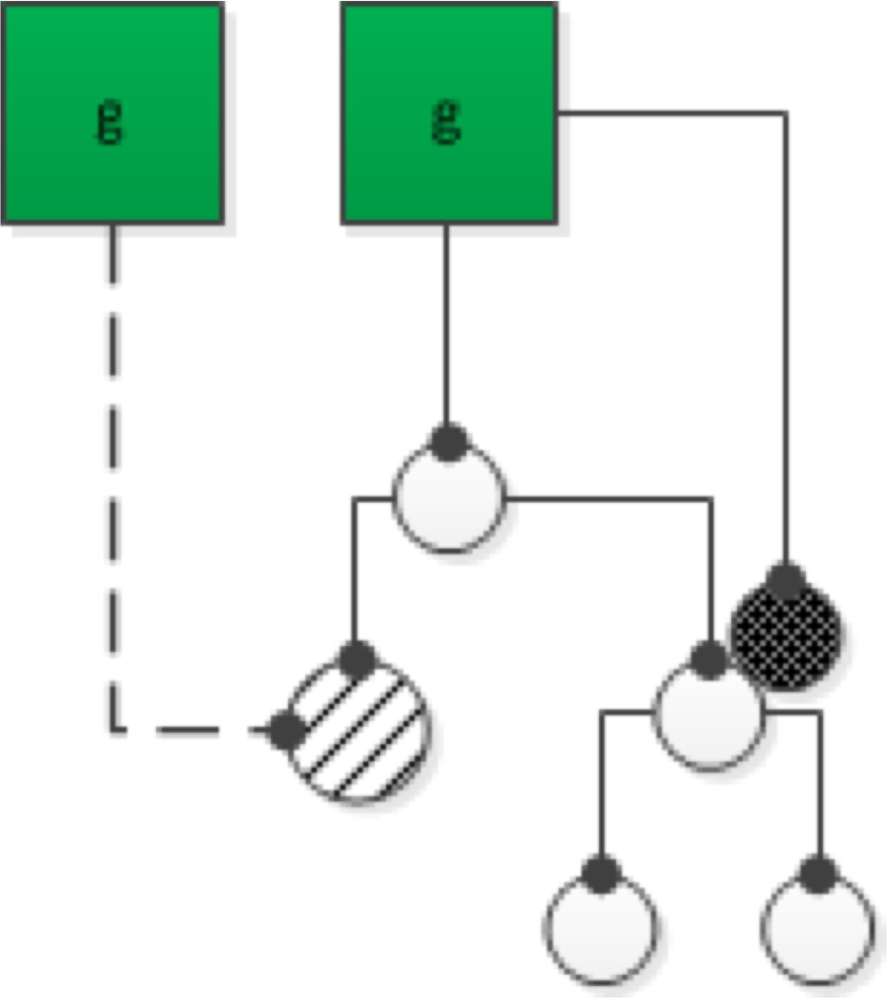
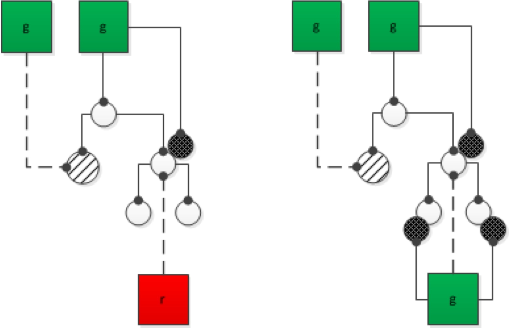
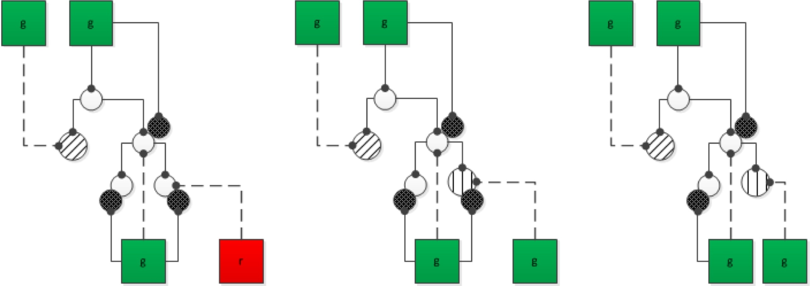
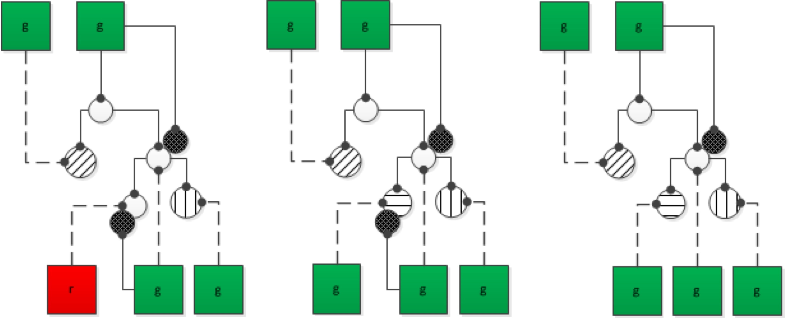
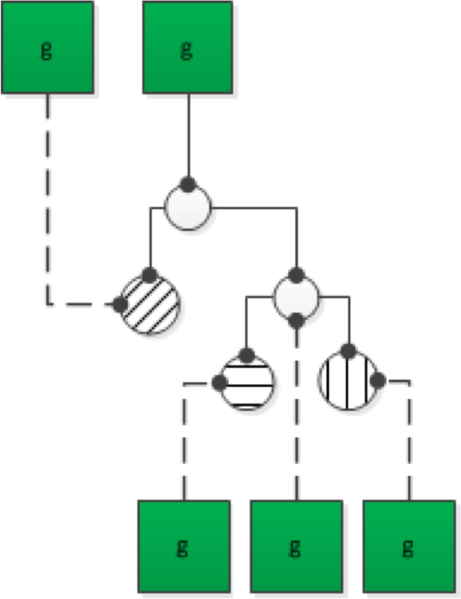
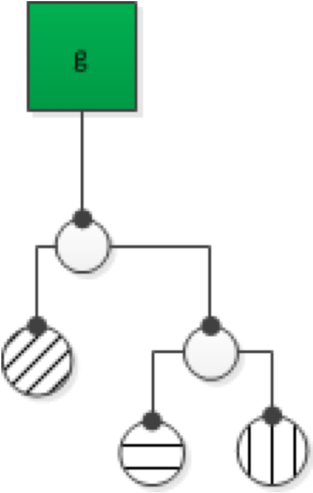

Like TTDD I start with a functional unit. But instead of writing a failing test right away, I think before coding. The result of such thinking is a solution approach. That means I develop an idea of how the problem can be solved using "custom tools". These custom tools are special "code machines" to be arranged in a transformation process. Think of it like an assembly line in a factory.

"First this is done, then that is done, finally something else is done." - that´s the most simple form of an idea for a solution. Yeah, it´s simple -- on the surface. But it´s powerful. Because what I get are smaller problems. And if I repeat this process for the resulting "custom tools" I get even smaller problems to solve.

This is called stepwise refinement. Divide a bigger problem into smaller, simpler ones. By thinking, by simulation, by imagination, by drawing on a whiteboard, maybe by experimenting with some code.

The two leaf-circles represent the function units for the "custom tools" somehow integrated into a whole by the initial functional unit, the root.

Next comes a red test. But this now is guided by my knowledge of the outline of a solution. The test case can be very different from one that you´d choose doing TTDD.

{width=30%}

The interesting question now is: How to get the test to green?

View it as a hypothesis. It states: If the function sub-units work like supposed, then the system under test (root) is correct. Because the job of the system under test is just to integrate those two leafs. Nothing more. That´s the Single Responsibility Principle (SRP) taken to an extreme.

How can this hypothesis be verified? By faking the implementation of the leafs. Using a mocking framework like JustMock that´s easy even without IoC/DI.

{width=40%}

Now I´ve two simpler problems to solve. Of course I do that the same way as before. I think, before I code. The focus now is one of the leaf functional units.

This time I don´t see how to further refine it, though. There are no "tools" I can think of. Just an "algorithm" I can code. In that case I´m back to TTDD.

However the leaf probably is a private method hidden behind the public root method. That´s why special measures need to be taken to make it teastable. A framework like JustMock helps here, too.

If needed, I add another test or refactor. But in the end I go back to the root test and remove the mock:

{width=60%}

Now the hypothesis is proven not only by mocks, but also by production code. That´s better.

Next I need to tackle the second leaf of the root. ITDD tells me to think first. Can I come up with smaller steps to reach the goal of the whole leaf? Yes, this time I can:

{width=70%}

That means I need to continue according to ITDD: Write a red test, then replace the sub-leafs with mocks.

And so the process continues "into the deep". I´m drilling down into the ever finer details of the solution.

Tackle the first leaf with ITDD:

Tackle the second leaf with ITDD:

Then backtrack to the top and remove the mock there:

{width=60%}

And finally... remove all non-root tests. They are not needed anymore. It´s just temporary scaffolding while fleshing out the solution. The essential test is the test of the root functional unit.

{width=40%}

That´s it. That´s what I mean by Informed TDD.

Technically it´s easy -- with a little help of a framework like JustMock or Typemock Isolator (both for .NET).

The benefits of ITDD I´ve come to value are:

  * Refactoring is less necessary, since there is a clean design before I start coding.
  * Testing of solution aspects does not need to go through the root all the time. That makes it easier on the test cases.
  * Test cases are less contrived because they are informed by a solution. This leads to less groping around for the right code.

Also I find this process natural compared to other "manufacturing tasks". I you build a table from wood or repair your kitchen sink you mess around and clean up. The surrounding of the "work item" loses and regains order. That´s what´s happening with ITDD too. Tests are written, mocks are created (mess) -- and later discarded (clean up). I don´t need to be careful with my tests or at least not with all the tests. Some tests have a long lifetime: acceptance tests. But others are just temporary.

I hope this helped to clarify how I think TDD can be enhanced by a little explicit thinking before coding.