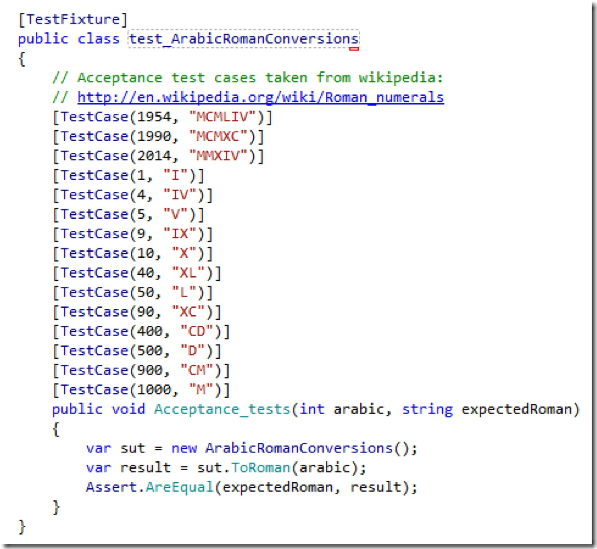
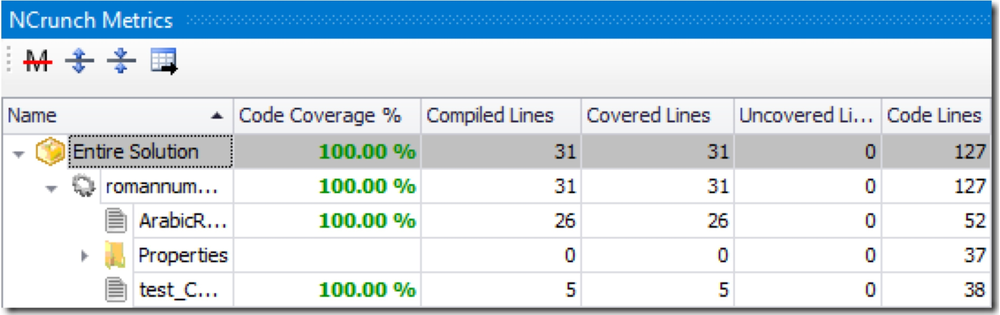

# Kata "To Roman Numerals"

In a comment on my article on what I call Informed TDD (ITDD) reader Gustav asked how this approach would apply to the kata "To Roman Numerals". And whether ITDD wasn´t a violation of TDD´s principle of leaving out "advanced topics like mocks".

I like to respond with this article to his questions. There´s more to say than fits into a commentary.

## Mocks and TDD

I don´t see in how far TDD is avoiding or opposed to mocks. TDD and mocks are orthogonal. TDD is about pocess, mocks are about structure and costs. Maybe by moving forward in tiny red+green+refactor steps less need arises for mocks. But then... if the functionality you need to implement requires "expensive" resource access you can´t avoid using mocks. Because you don´t want to constantly run all your tests against the real resource.

True, in ITDD mocks seem to be in almost inflationary use. That´s not what you usually see in TDD demonstrations. However, there´s a reason for that as I tried to explain. I don´t use mocks as proxies for "expensive" resource. Rather they are stand-ins for functionality not yet implemented. They allow me to get a test green on a high level of abstraction. That way I can move forward in a top-down fashion.

But if you think of mocks as "advanced" or if you don´t want to use a tool like JustMock, then you don´t need to use mocks. You just need to stand the sight of red tests for a little longer ;-) Let me show you what I mean by that by doing a kata.

## ITDD for "To Roman Numerals"

gustav asked for the kata "To Roman Numerals". I won´t explain the requirements again. You can find descriptions and TDD demonstrations all over the internet, like this one from Corey Haines.

Now here is, how I would do this kata differently.

### 1. Analyze

A demonstration of TDD should never skip the analysis phase. It should be made explicit. The requirements should be formalized and acceptance test cases should be compiled.

"Formalization" in this case to me means describing the API of the required functionality. "[D]esign a program to work with Roman numerals" like written in this "requirement document" is not enough to start software development. Coding should only begin, if the interface between the "system under development" and its context is clear.

If this interface is not readily recognizable from the requirements, it has to be developed first. Exploration of interface alternatives might be in order. It might be necessary to show several interface mock-ups to the customer -- even if that´s you fellow developer.

Designing the interface is a task of it´s own. It should not be mixed with implementing the required functionality behind the interface. Unfortunately, though, this happens quite often in TDD demonstrations. TDD is used to explore the API and implement it at the same time. To me that´s a violation of the Single Responsibility Principle (SRP) which not only should hold for software functional units but also for tasks or activities.

In the case of this kata the API fortunately is obvious. Just one function is needed: _string ToRoman(int arabic)_. And it lives in a class _ArabicRomanConversions_.

Now what about acceptance test cases? There are hardly any stated in the kata descriptions. Roman numerals are explained, but no specific test cases from the point of view of a customer. So I just "invent" some acceptance test cases by picking roman numerals from a wikipedia article. They are supposed to be just "typical examples" without special meaning.

Given the acceptance test cases I then try to develop an understanding of the problem domain. I´ll spare you that. The domain is trivial and is explain in almost all kata descriptions. How roman numerals are built is not difficult to understand. What´s more difficult, though, might be to find an efficient solution to convert into them automatically.

### 2. Solve

The usual TDD demonstration skips a solution finding phase. Like the interface exploration it´s mixed in with the implementation. But I don´t think this is how it should be done. I even think this is not how it really works for the people demonstrating TDD. They´re simplifying their true software development process because they want to show a streamlined TDD process. I doubt this is helping anybody.

Before you code you better have a plan what to code. This does not mean you have to do "Big Design Up-Front". It just means: Have a clear picture of the logical solution in your head before you start to build a physical solution (code). Evidently such a solution can only be as good as your understanding of the problem. If that´s limited your solution will be limited, too.

Fortunately, in the case of this kata your understanding does not need to be limited. Thus the logical solution does not need to be limited or preliminary or tentative. That does not mean you need to know every line of code in advance. It just means you know the rough structure of your implementation beforehand. Because it should mirror the process described by the logical or conceptual solution.

Here´s my solution approach:

The arabic "encoding" of numbers represents them as an ordered set of powers of 10. Each digit is a factor to multiply a power of ten with. The "encoding" 123 is the short form for a set like this: {1*10^2, 2*10^1, 3*10^0}. And the number is the sum of the set members.

The roman "encoding" is different. There is no base (like 10 for arabic numbers), there are just digits of different value, and they have to be written in descending order. The "encoding" XVI is short for [10, 5, 1]. And the number is still the sum of the members of this list.

The roman "encoding" thus is simpler than the arabic. Each "digit" can be taken at face value. No multiplication with a base required. But what about IV which looks like a contradiction to the above rule? It is not -- if you accept roman "digits" not to be limited to be single characters only. Usually I, V, X, L, C, D, M are viewed as "digits", and IV, IX etc. are viewed as nuisances preventing a simple solution.

All looks different, though, once IV, IX etc. are taken as "digits". Then MCMLIV is just a sum: M+CM+L+IV which is 1000+900+50+4. Whereas before it would have been understood as M-C+M+L-I+V -- which is more difficult because here some "digits" get subtracted. Here´s the list of roman "digits" with their values:

{line-numbers=off}
```
{1, I}, {4, IV}, {5, V}, {9, IX}, 
{10, X}, {40, XL}, {50, L}, {90, XC}, 
{100, C}, {400, CD}, {500, D}, {900, CM}, 
{1000, M}
```

Since I take IV, IX etc. as "digits" translating an arabic number becomes trivial. I just need to find the values of the roman "digits" making up the number, e.g. 1954 is made up of 1000, 900, 50, and 4. I call those "digits" factors.

If I move from the highest factor (M=1000) to the lowest (I=1) then translation is a two phase process:

1. Find all the factors

2. Translate the factors found

3. Compile the roman representation

Translation is just a look-up. Finding, though, needs some calculation:

1. Find the highest remaining factor fitting in the value

2. Remember and subtract it from the value

3. Repeat with remaining value and remaining factors

Please note: This is just an algorithm. It´s not code, even though it might be close. Being so close to code in my solution approach is due to the triviality of the problem. In more realistic examples the conceptual solution would be on a higher level of abstraction.

With this solution in hand I finally can do what TDD advocates: find and prioritize test cases.

As I can see from the small process description above, there are two aspects to test:

  * Test the translation
  * Test the compilation
  * Test finding the factors

Testing the translation primarily means to check if the map of factors and digits is comprehensive. That´s simple, even though it might be tedious.

Testing the compilation is trivial.

Testing factor finding, though, is a tad more complicated. I can think of several steps:

1. First check, if an arabic number equal to a factor is processed correctly (e.g. 1000=M).

2. Then check if an arabic number consisting of two consecutive factors (e.g. 1900=[M,CM]) is processed correctly.

3. Then check, if a number consisting of the same factor twice is processed correctly (e.g. 2000=[M,M]).

4. Finally check, if an arabic number consisting of non-consecutive factors (e.g. 1400=[M,CD]) is processed correctly.

I feel I can start an implementation now. If something becomes more complicated than expected I can slow down and repeat this process.

### 3. Implement

First I write a test for the acceptance test cases. It´s red because there´s no implementation even of the API. That´s in conformance with "TDD lore", I´d say:


Next I implement the API:


The acceptance test now is formally correct, but still red of course. This will not change even now that I zoom in. Because my goal is not to most quickly satisfy these tests, but to implement my solution in a stepwise manner. That I do by "faking" it: I just "assume" three functions to represent the transformation process of my solution:


My hypothesis is that those three functions in conjunction produce correct results on the API-level. I just have to implement them correctly. That´s what I´m trying now - one by one.

I start with a simple "detail function": _Translate()_. And I start with all the test cases in the obvious [equivalence partition](http://en.wikipedia.org/wiki/Equivalence_partitioning):


As you can see I dare to test a private method. Yes. That´s a white box test. But as you´ll see it won´t make my tests brittle. It serves a purpose right here and now: it lets me focus on getting one aspect of my solution right.

Here´s the implementation to satisfy the test:


It´s as simple as possible. Right how TDD wants me to do it: KISS.

Now for the second equivalence partition: translating multiple factors. (It´a pattern: if you need to do something repeatedly separate the tests for doing it once and doing it multiple times.)


In this partition I just need a single test case, I guess. Stepping up from a single translation to multiple translations is no rocket science:


Usually I would have implemented the final code right away. Splitting it in two steps is just for "educational purposes" here. How small your implementation steps are is a matter of your programming competency. Some "see" the final code right away before their mental eye -- others need to work their way towards it.

Having two tests I find more important.

Now for the next low hanging fruit: compilation. It´s even simpler than translation.


A single test is enough, I guess. And normally I would not even have bothered to write that one, because the implementation is so simple. I don´t need to test .NET framework functionality. But again: if it serves the educational purpose...


Finally the most complicated part of the solution: finding the factors. There are several equivalence partitions. But still I decide to write just a single test, since the structure of the test data is the same for all partitions:


Again, I´m faking the implementation first:


I focus on just the first test case. No looping yet.

Faking lets me stay on a high level of abstraction. I can write down the implementation of the solution without bothering myself with details of how to actually accomplish the feat.

That´s left for a drill down with a test of the fake function:


There are two main equivalence partitions, I guess: either the first factor is appropriate or some next.

The implementation seems easy. Both test cases are green. (Of course this only works on the premise that there´s always a matching factor. Which is the case since the smallest factor is 1.)


And the first of the equivalence partitions on the higher level also is satisfied:


Great, I can move on. Now for more than a single factor:


Interestingly not just one test becomes green now, but all of them. Great!


You might say, then I must have done not the simplest thing possible. And I would reply: I don´t care. I did the most obvious thing. But I also find this loop very simple. Even simpler than a recursion of which I had thought briefly during the problem solving phase.

And by the way: Also the acceptance tests went green:


Mission accomplished. At least functionality wise.

Now I´ve to tidy up things a bit. TDD calls for refactoring. Not uch refactoring is needed, because I wrote the code in top-down fashion. I faked it until I made it. I endured red tests on higher levels while lower levels weren´t perfected yet. But this way I saved myself from refactoring tediousness.

At the end, though, some refactoring is required. But maybe in a different way than you would expect. That´s why I rather call it "cleanup".

First I remove duplication. There are two places where factors are defined: in _Translate()_ and in _Find_factors()_. So I factor the map out into a class constant.


Which leads to a small conversion in _Find_factors()_:


And now for the big cleanup: I remove all tests of private methods. They are scaffolding tests to me. They only have temporary value. They are brittle. Only acceptance tests need to remain.

However, I carry over the single "digit" tests from _Translate()_ to the acceptance test. I find them valuable to keep, since the other acceptance tests only exercise a subset of all roman "digits".

This then is my final test class:



And this is the final production code:


Test coverage as reported by NCrunch is 100%:



## Reflection

Is this the smallest possible code base for this kata? Sure not. You´ll find more concise solutions on the internet.

But LOC are of relatively little concern -- as long as I can understand the code quickly. So called "elegant" code, however, often is not easy to understand. The same goes for KISS code -- especially if left unrefactored, as it is often the case.

That´s why I progressed from requirements to final code the way I did. I first understood and solved the problem on a conceptual level. Then I implemented it top down according to my design.

I also could have implemented it bottom-up, since I knew some bottom of the solution. That´s the leaves of the functional decomposition tree.

Where things became fuzzy, since the design did not cover any more details as with _Find_factors()_, I repeated the process in the small, so to speak: fake some top level, endure red high level tests, while first solving a simpler problem.

Using scaffolding tests (to be thrown away at the end) brought two advantages:

  * Encapsulation of the implementation details was not compromised. Naturally private methods could stay private. I did not need to make them internal or public just to be able to test them.
  * I was able to write focused tests for small aspects of the solution. No need to test everything through the solution root, the API.

The bottom line thus for me is: Informed TDD produces cleaner code in a systematic way. It conforms to core principles of programming: Single Responsibility Principle and/or Separation of Concerns. Distinct roles in development -- being a researcher, being an engineer, being a craftsman -- are represented as different phases. First find what, what there is. Then devise a solution. Then code the solution, manifest the solution in code.

Writing tests first is a good practice. But it should not be taken dogmatic. And above all it should not be overloaded with purposes.

And finally: moving from top to bottom through a design produces refactored code right away. Clean code thus almost is inevitable -- and not left to a refactoring step at the end which is skipped often for different reasons.

PS: Yes, I have done this kata several times. But that has only an impact on the time needed for phases 1 and 2. I won´t skip them because of that. And there are no shortcuts during implementation because of that.