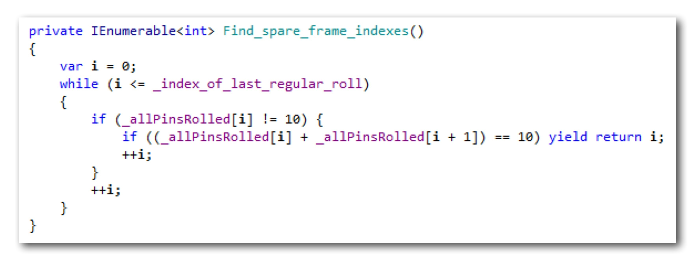

# Kata "Bowling Game"
One of the more popular katas is "Bowling Game". I´ve written about it [before](http://geekswithblogs.net/theArchitectsNapkin/archive/2011/07/05/flowing-bowling-game-kata-i.aspx). But today I want to take a second stab at it. And isn´t that one of the purposes of katas? To repeatedly doing them in order to go deeper.

## 1. Analyze
Robert C. Martin has [documented his approach](http://de.slideshare.net/lalitkale/bowling-game-kata-by-robert-c-martin) to solving the problem. Here´s his description of the task. Since I´m no bowling afficionado I like to cite it.

So what have we here? At first the rules seemed inscrutable to me. But then... Actually it´s pretty simple, I´d say.

There are _rolls_ which knock down a number of _pins_ (0..10). The rolls are gathered into _frames_ of 1 or 2 rolls. It´s just 1 roll if with that roll all pins got knocked down (a _strike_). Otherwise it´s 2 rolls. 

That´s it for frames. Frames are structural elements. They gather data. As you can see, spares have no influence on how rolls get framed.

Each frame gets a _score_. Calculating a frame´s score starts simple: just add the pins of its rolls. However, there are conditions for bonuses. If a frame is/has a strike, add the pins of the following two rolls to the frame score. Or if the frame´s "simple score" is 10, then it´s a _spare_, and you add the pins of only the following roll to its score.

The total score then is the sum of all frame scores.

Strikes are a matter of framing and of scoring. Spares are just a matter of scoring - at least as long as you don´t want to display spares in a special way like Robert C. Martin does. Which brings me to the required form of the solution.

The solution is supposed to look like this:

It´s an API to use the "bowling game component" through.

Interestingly, there´s no notion of frames here. It´s just about rolls/pins and the total score of the game.

Nothing is said about error cases. No check for a second roll in a frame to with 10 pins. No check for more rolls than are allowed. Also score will only be called once at the end. So no check required for less rolls than necessary to complete a game.

What are the acceptance test cases? None are listed in Robert C. Martins demonstration. So I take them from my blog posting. This is my overall acceptacnce test method based on the API requested:

## 2. Solve
Robert C. Martin invests in a "quick design session" - of which after that little seems to transpire into the production code. Although he shows three additional classes, the final code only contains _Game_. Strange. What was the use of that? My only explanation: It wasn´t design but analysis. He used the class diagram to become clear about the problem domain.

But do data structures really play a big role in thise scenario? I doubt it. For one there is no data structure visible from the outside. And then it´s all about scores. Even though frame scores need to be calculated just a single number needs to be kept for each frame.

No, I think instead of designing data structures it´s better to focus on functionality. It´s always logic over containers. Logic beeing expressions and control flow statements, and containers being functions, classes, libraries etc.

So what´s supposed to happen when _Roll()_ is called? Nothing much, I´d say. No calculations here, just remembering the roll´s pins. A simple list will do. Do I need a test for that? Hardly.

The property _Score_ is where "it" really happens. That´s what I really need a solution approach for.

All would be simple, if there were no spares. Without spares scoring would not need to look at frames. Summing up the pins and adding a bonus to strikes would be enough:

1. Sum pins
2. Add bonus for strikes

But why not continue like this?

1. Sum pins
2. Add bonus for strikes
3. Add bonus for spares

The first passes of the pins are easy. But what about the third one? Some refinement seems in order.

To detect a spare, I need to frame the pins rolled. I think that works like:

* Get roll. If it´s not a strike, then add next roll and check for spare; otherwise start all over with next roll.
* If it´s a spare, add bonus to total score.

This now sounds simple enough. I guess I can start coding...

## 3. Implementation
First the low hanging fruit: _Roll()_ plus the internal data store.

{width=70%}

I don´t write a test. It´s so dead simple, I trust the compiler. Plus, if this does not work, I´ll realize it immediately when testing _Score_. However, if I should decide to change storing pins I might add a test.

Next the top level of _Score_. A tracer bullet implementation doing just the simplest stuff possible to achieve some result.

{width=70%}

Do I need a test case for just this? No. Some acceptance tests have already gone green:

Next increment: Flesh out adding a strike bonus. There is already an acceptance test in place for recognizing strikes. So I don´t start with another red test, but focus on the production code right away.

Straightforward, right? But unfortunately it does not deliver the expected result.

The highlighted test should have gone green. But it does not. Why? Because my solution approach is flawed. Damn! I need to backtrack...

## Analyze (revisted)
My assumption, frames only matter for spares was wrong. They don´t matter - unless it´s the last frame. And there is a last frame. I did not take that into account. Maybe because I´m not much into bowling. You only roll balls until you finished 10 frames. If you´re an expert that means you´ll do 10 rolls + 2 bonus rolls. If you´re a newbie never bringing down all ten pins it means 20 rolls.

From the number of rolls alone, though, it cannot be determined where the 10th frame ends. So it cannot be determined when to stop adding pins to the total score in the first pass _Sum_pins()_.

## Solve (revisited)
To adjust my solution I need to introduce frames right from the start. But do I really need to frame the rolls? That wouldn´t be necessary for summation. And it would hinder adding bonuses, since doing that on the list is so easy.

No, I guess I just need to determine the index of the last roll in the 10th frame. That could then inform the downstream summations where to cut off.

1. Determine index of last regular roll
2. Sum pins
3. Add bonus for strikes
4. Add bonus for spares

How to determine the index? I need to go forward through the pins and count frames:

* Advance index; get roll. If it´s a strike, close frame; otherwise advance index and close frame.
* Repeat until 10 frames have been closed.

## Implementation (continued)
First I add the additional method to the current implementation and fake its functionality.

{width=80%}

Currently a fixed index is set. If I use that, most tests will of course fail. But at least one test should go green: the one that failed above. And it does.

I could have done without. But it seemed nice to already integrate the index into what was there.

For actually determining the index I feel I need an extra test:

This is partly green already due to the constant. I take that as a validation of how I access the private members of the system under test.

And here´s the code that actually does the job.

{width=80%}

Interestingly this leads to an acceptance test failing which had been green already:

That however is a good sign. The test had been green due to the wrong reasons. This now is an "honest red".

Ok, I guess I´m back on track now. Need to tackle spares now. They are the cause for the red tests. Now that I need to implement it, the function seems a bit complicated. The solution approach so far design does not really comfort me anymore. I would like a more simple approach.

### Solve (revisited)
I like sequences of functionality. Processes. Pipelines. Can I break down adding spare bonuses to another sequence like I got on the top level? How about this:

1. Find the indexes of rolls starting spare frames
2. Add the bonus roll pins to the total score

### Back to implementation
The second step now should be trivial. Here´s is the sequence and the second step:

This looks easy. But the hard part just got postponed - fortunately it got simpler by that:

And that did it. All acceptance tests green. Hurray!

{width=60%}

As the last step before some reflection I remove the scaffolding test for _Determine_index_of_last_regular_roll()_. It´s a brittle test, it´s a whitebox text. It helped me at a certain point, but eventually it´s unnecessary. What it covers is covered by the acceptance tests, too.

## Reflection
Did this go well? I wasn´t able to just flow through analysis, design, implementation in a one way fashion. I had to make a detour. Also my solution has some 50% more LOC than Robert C. Martin´s. Isn´t that proof of ITDD being much effort for meager results?

No, I don´t think so. Even though I´m a bit disappointed I think the overall approach is good. I would not do it any other way next time.

Firstly: No method can compensate for misunderstanding requirements. The detour was due to an incomplete/errorneous analysis. Anybody doing "traditional" TDD would have hit a wall sooner or later. Maybe I even hit it sooner, because I wasn´t progressing in tiny KISS steps. With a solution in hand I move forward a little bolder than the average TDD-guy.

Secondly: You can interpret KISS in two ways. One leads to less LOC. The other leads to more understandability. Even though my solution is heavier in terms of LOC, I think it´s easy to understand - even easier than ones with less LOC. (Obviously I need to think that way, right? It´s my precious solution, my baby ;-)

The reason for that I locate in separating rules which are aspects of the excercise. If you want to change for example how strike bonuses are handled, you just need to touch one function: _Add_bonus_for_strike()_. It´s all in there. The same for the other scoring aspects.

This decoupling leads to duplication, you might say. Each of those aspects is iterating over the rolls again. Isn´t that detrimental to performance? Doesn´t that lead to inconsistencies?

That´s one school of thought. And of course I know the DRY principle and usually follow it. But principles are forces not always pulling in the same direction. So a balance needs to be found. In this case I decided in favor of less coupling and paying with some moisture.

But I think this is easily readable code:

{width=70%}

At one glance I get how the solution works - not all the details, of course, but the big picture. Then, if I like, I can drill down. How, for example, are bonuses for strikes calculated? Here´s the answer. All contained in one function:

But of course the implementation depends on my understanding of the problem. What my understanding is, I´ve made explicit. Arguably that´s a misunderstanding. But at least it is out in the open. We _can_ discuss it. As we also _can_ discuss my solution approach, which is likewise explicit.

So my point is less, whether my solution is the most KISS one. It´s much more about explicitness, about sharable mental models. Because we all fail sometime. We all produce less optimal or even buggy code. Then it´s important to be able to talk to other people to get their input. Or maybe there is no talking, since those people need to fix the code on their own. It´s these situations that benefit from explicit solutions - which might be less elegant, but easy to "decode".

That´s what Informed TDD is trying to help with.