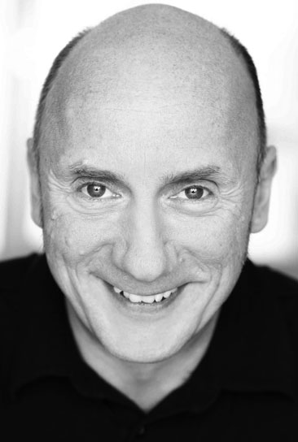

# About the Author

Ralf Westphal is a freelance consultant, project coach, trainer, author, and speaker on software architectural topics and team organization.

He is the co-founder of the "Clean Code Developer" initiative to increase software quality.

Ralf is based in Hamburg, Germany.

* Homepage (de): [One Man Think Tank](http://ralfw.de)
* Email: [info@ralfw.de](mailto:info@ralfw.de)
* Twitter: [@ralfw](https://twitter.com/ralfw)
 
* Blog (de): [One Man Think Tank](http://blog.ralfw.de)
* Blog (en): [The Architect´s Napkin](http://geekswithblogs.net/thearchitectsnapkin)